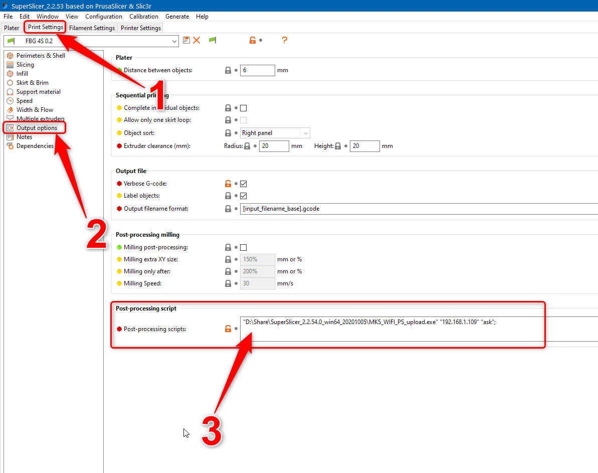

# MKS-WIFI Uploader for Prusa Slicer (and forks)

This simple pice of code allows uploading files and starting print jobs for printers equipped with MKS-WIFI module for KS Robin Nano Board (i.e. Flyingbear Ghost 4S/5)

### Versions
It is written on Python and available in 2 versions:
+ Python script (requires Python 3 with **requests** package)
+ Windows x64 executable (more conwinient, no requirements to run)

I might think about releasing additional executables (like Win32 or linux) if there will be real demand for it. Until then you might always use Python script version.

### Usage

It is originally intended to work as a post-processing script in Prusa Slicer (or it's forks like Slic3r++/SuperSlicer)
To use Uploader select your Print profile and go to the Output options. Here insert following command into the Post-processing script
##### To use executable (see screenshot)
```
"\path\to\the\executable\MKS_WIFI_PS_upload.exe" ip_address mode;
```

##### To use python script
```
"\path\to\the\python\installation\pythonw.exe" "\path\to\the\script\MKS_WIFI_PS_upload.pyw" ip_address mode;
```

##### ip_address - IP adress of the printer in your local network
##### mode - one of the following options:
+ **ask** - when a file is uploaded the script will ask if you wont to immediately start printing it
+ **always** - when a file is uploaded the script will immediately start printing it without asking
+ **never** - when a file is uploaded the script will not start any print job and will not ask anything

### Standalone mode
Despite being intended as a post-processing script, Uploader can be used completely standalone.
If run without any options (i.e. double click on the executable) it will first prompt you to select a file you want to upload and ask for IP adress of your printer. It will then proceed with uploading file and ask if you want to print it (similar to rumming in **ask** mode)

Alternatively you can run it from a command line:
```
MKS_WIFI_PS_upload.exe ip_addr mode "\path\to\the\file\for\upload.gcode"
```